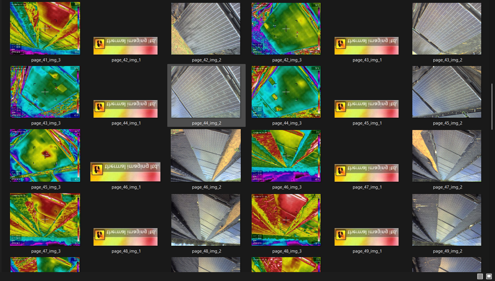
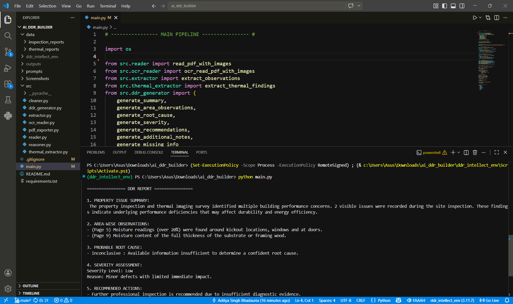
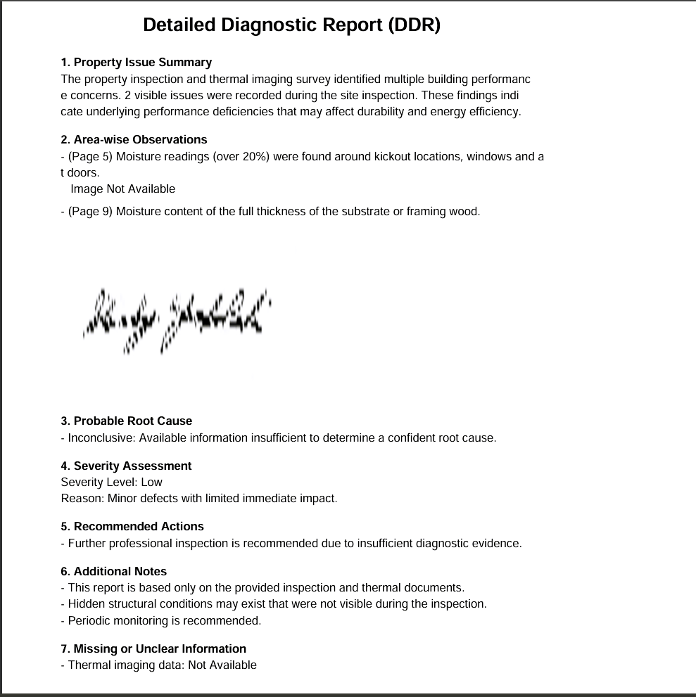

# AI DDR Builder

AI DDR Builder is an end-to-end Applied AI system that automatically generates a **Detailed Diagnostic Report (DDR)** from building inspection and thermal imaging PDF documents.

The system processes unstructured documents, extracts insights, correlates visible and hidden issues, and produces a **client-ready report with supporting images**.

---

## 🚀 What it does

- Reads **Inspection Reports** and **Thermal Imaging Reports**
- Supports:
  - Digital PDFs
  - Scanned PDFs (via OCR)
- Extracts **defects and anomalies**
- Correlates **inspection + thermal findings**
- Identifies **probable root causes**
- Performs **severity assessment with reasoning**
- Embeds **relevant images under observations**
- Generates a **structured DDR PDF report**

---

## ⚙️ Workflow

Inspection PDF + Thermal PDF  
→ OCR (if scanned)  
→ Text Cleaning  
→ Observation Extraction (NLP)  
→ Thermal Analysis  
→ Reasoning Engine  
→ Severity Assessment  
→ DDR Report Generation (with images)

---

## 🧠 Technologies Used

- Python  
- spaCy (NLP)  
- Tesseract OCR  
- PyMuPDF (fitz)  
- pdf2image  
- ReportLab  

---

## 📂 Project Structure
```
ai_ddr_builder/
│
├── data/
│ ├── inspection_reports/
│ └── thermal_reports/
│
├── outputs/
│ ├── images/
│ └── reports/
│
├── src/
│ ├── reader.py
│ ├── ocr_reader.py
│ ├── extractor.py
│ ├── thermal_extractor.py
│ ├── reasoner.py
│ ├── ddr_generator.py
│ ├── pdf_exporter.py
│
├── assets/
├── main.py
├── requirements.txt
└── README.md

```
---

## 📊 Input Data

### Inspection Reports
- Contain on-site observations by engineers  
- Examples:
  - Cracks
  - Leakage
  - Corrosion
  - Electrical faults  

### Thermal Reports
- Generated using infrared thermography  
- Detect hidden issues such as:
  - Insulation failure  
  - Air leakage  
  - Moisture patterns  
  - Thermal bridging  
  - Energy loss  

---

## 📄 Output (DDR Report)

The generated report includes:

1. Property Issue Summary  
2. Area-wise Observations (with images)  
3. Probable Root Cause  
4. Severity Assessment (with reasoning)  
5. Recommended Actions  
6. Additional Notes  
7. Missing or Unclear Information  

---

## 🖼️ Screenshots

### 🔹 Extracted Observations


### 🔹 DDR Sections Preview


### 🔹 Final Generated Report


---

## ▶️ Run the Project

```bash
python main.py
📁 Output Location

Final report will be saved at:

outputs/reports/DDR_Report.pdf
```
## Future Improvements

* LLM-based reasoning (GPT integration)
* Web UI (Streamlit / React)
* Better confidence scoring
* Improved document understanding

---

##  Why this Project Stands Out

* Works on **real-world unstructured data**
* Combines **OCR + NLP + reasoning + vision**
* Generates **professional client-ready reports**
* Designed for **scalability and generalization**

## 👨‍💻 Author

Aditya Singh Bhadauria